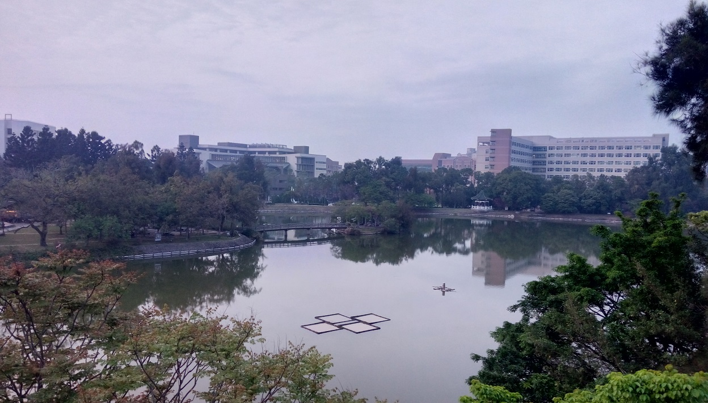
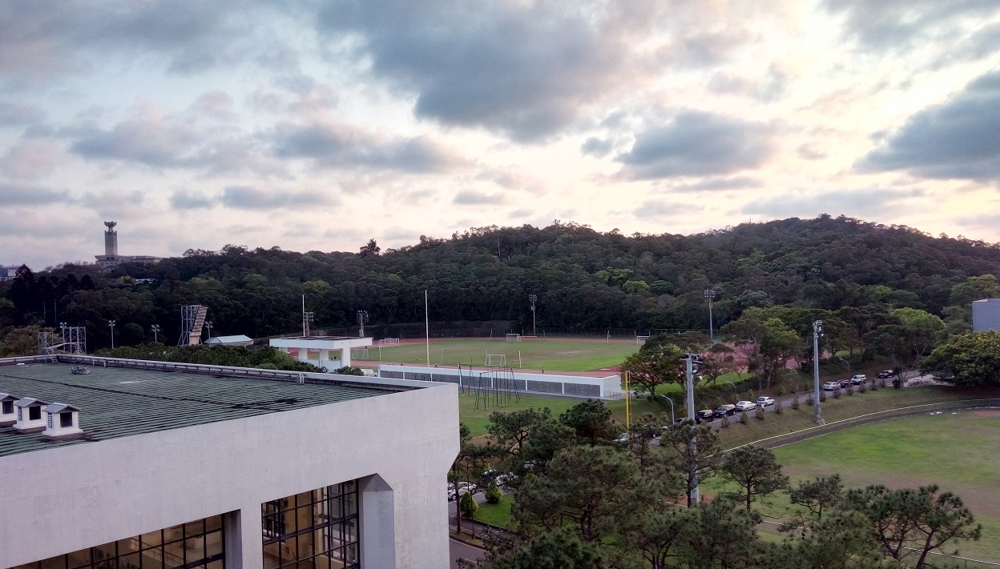
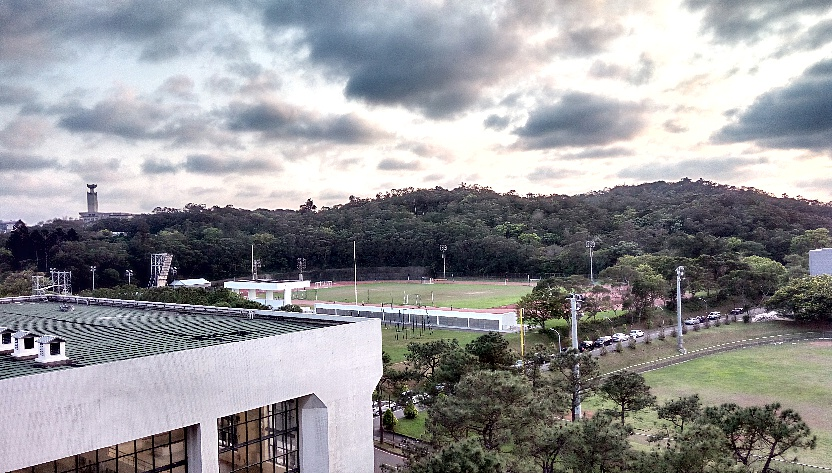
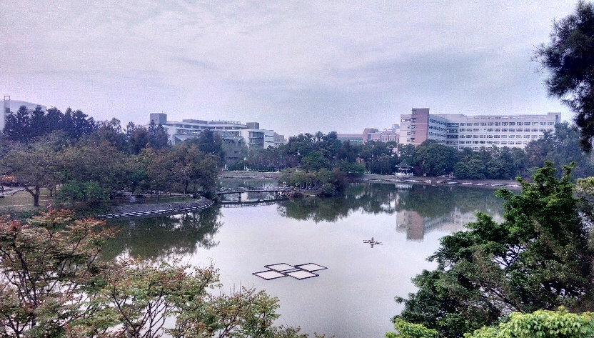
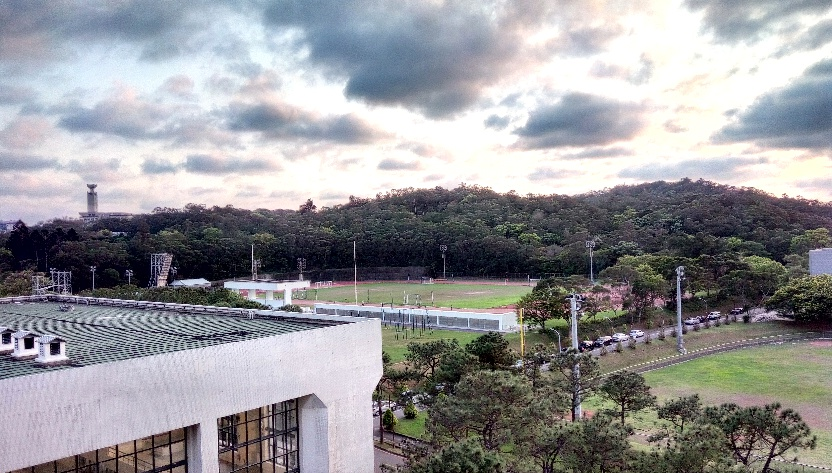
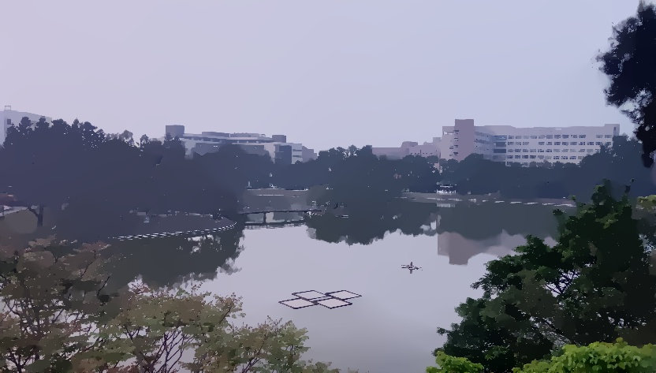

# Tone Enhancement

Enhance contrast in image by seperating it into base and detail layers with some modifications then merge them back.


## Usage

- Make directories: `input` and `output`
- Put all your images in the `input` folder
- Execute the program

    ```bash
    python main.py {method_name: `BF` | `L0`}
    ```
- All the results will show with window displaying and save in `output`


## Method

Here are two decomposition methods implemented in this project,

- Bilateral Filtering, implemented by OpenCV
- L0 smoothing, and implementation comes from [L0 gradient minimization](https://github.com/t-suzuki/l0_gradient_minimization_test)

## Result

- Source input

    

    

- With bilateral filtering

    

    

- With L0

    

    


## Description

- Decompose the input image into base layer (two methods: bilateral filtering and L0 smoothing) and detail layer (the residuals from subtraction of input and smoothed image) .

    - We choose proper parameters for each method to make the final vivid outputs.
    - In bilateral filtering, the variances (sigma values) of color and spatial are important, the filter can blur the input however preserve the edges with strong gradients. From the experiments, if sigma value for color set too large, the edges of output image will get rounded with shimmering and blurring color halos.

        

    - For L0 smoothing, we use the default parameter with functions from the referred L0 implementation, and the input will be smoothed out more dramatically whose results may look like semantic segmentation.

- Enhance the detail layer and combine the modified base layer with the enhanced detail layer to get the output.

    - First, apply some modifications on base layer

        - Squeeze the range of base image and then do gamma correction to change the luminance gently.
        - Use contrast limited adaptive histogram equalization to modify the histogram of input image, then finally enlarge the output back to the original color range.

    - Second, enhance the detail layer

        - Apply unsharp filter to sharpen the detail infomation
        - Then amplify the sharpend signals by almost half of origin
